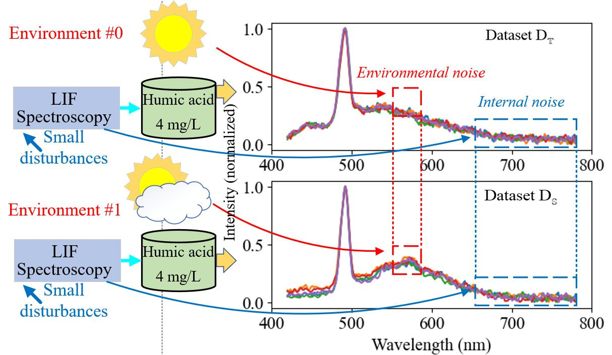
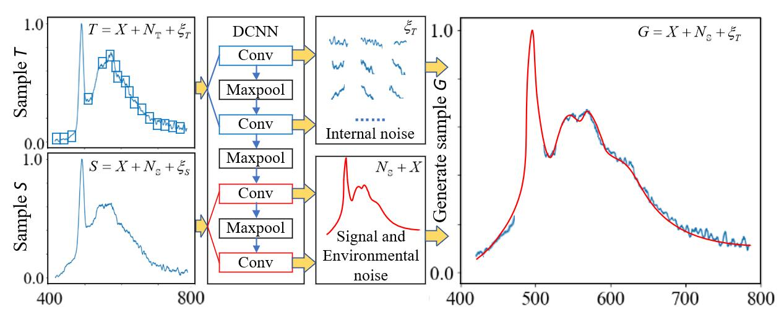
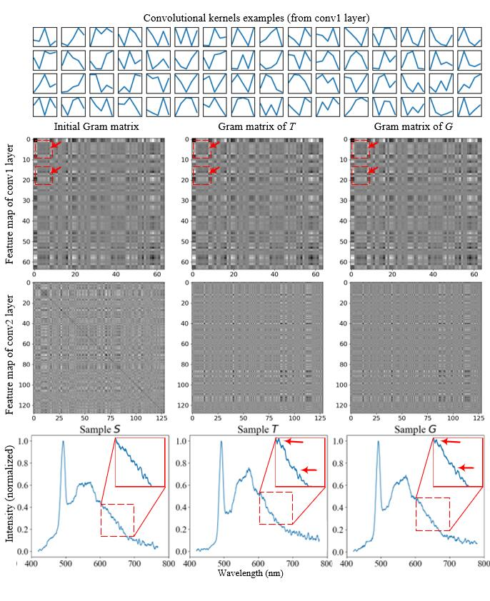
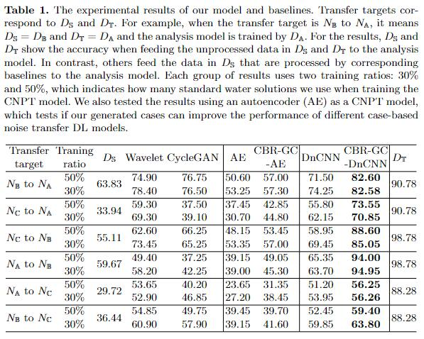

# Can We Transfer Noise Patterns? A Multi-environment Spectrum Analysis Model Using Generated Cases

### Authors: Haiwen Du, Zheng Ju, Yu An, Honghui Du, Dongjie Zhu\*, Zhaoshuo Tian, Aonghus Lawlor and Ruihai Dong\*

### This work has been accepted by ICONIP-2023 

---

## Highlights:

- we develop a noise transfer model to transfer the \textit{environmental noise} pattern  $N_\mathbb{S}$ of dataset $D_\mathbb{S}$ into the \textit{environmental noise} pattern $N_\mathbb{T}$ of dataset $D_\mathbb{T}$ (also denoising when $D_\mathbb{T}$ is \textit{environmental noise}-free);

- propose a network structure for extracting \textit{environmental noise} $N_\mathbb{S}$, signal $X$, and \textit{baseline noise} $\xi_{T}$ from a D2D case $S$ and $T$, thereby generating a new sample $G$ that only have \textit{environmental noise} pattern differences $N_\mathbb{S-T}$ with sample $T$. It is the first work to enhance the learning performance of denoising models by generating new cases; and

- verify the contribution of our model on 1D LIFS noise patterns transferring tasks. It significantly improves the performance of chemical oxygen demand (COD) parameter analysis model under different noise patterns.
---

## Tips for Running the Codes:

1. Please unzip the dataset in `./data` directory before trying `*.ipynb` files.

- `./data/new*.zip` are the output of S2S cases generating model.

- `./data/*_npy.zip` are the raw LIFS data in different envrionments.

- `./data/*_wv.zip` are the denoised LIFS data by wavelet model in different envrionments.

- `./data/baseline_output.zip` saves the output of CNPT models, i.e., the data feed to COD parameter analysis model for validating.

2. The pre-trained analysis model for feature extracting model in S2S case generating process is `/save/model_1DCNN_MIX.pth`.

3. For the final results, we train 10 COD analysis models using $D_\mathbb{T}$ and feed the output of CNPT ($D_\mathbb{S}$ to $D_\mathbb{T}$) to them. So the results are the average of 10 tests. These models are saved as `/save/(DT)_(pre-process method)_1DCNN_MIX.pth`, while `wv` means the model is trained by wavelet denoised data, `npy` means the model is trained by the raw data.

4. Install the needed packages in `requirement.txt`

---

## Introduction:

We build a **sample-sample** (S2S) case base to exclude the interference of **sample-level noise** on **dataset-level noise** learning, enhancing the CBR system's learning performance. Experiments on spectral data with different background noises demonstrate the good noise-transferring ability of the proposed method against baseline systems ranging from wavelet denoising, deep neural networks, and generative models. We posit that our method can enhance the performance of DL models by generating high-quality case bases, extending CBR's application scope.

## Cases in Existing Noise Transfer Models:

It is suitale to apply systems to the target task. We can uses the LIFS of the same standard solution in different environments as cases. Therefore, noise pattern differences can be learned by analysing these cases and applied to transfer noise patterns of unknown samples.

With this, we only need to train the model in one noise pattern, and then we can process the data in various environments by unifying their noise patterns.

## Problem Statements:

- The inevitable **sample-level** *internal noise* makes the model unable to obtain the paired data that only differ in **dataset-level** *environmental noise*.

- The **sample-level** *internal noise* appears at a high level of randomness. Traditional DL-based models like auto-encoder will directly smooth them like denoising model does and only transfer the posistion fixed low-frequency noise patterns (*environmental noise*). It will leads to overfitting problems because the **sample-level** *internal noise* and can also show low-frequency noise patterns and superimposed on *environmental noise*.

## Proposed Method:

Based on the hypothesis that deeper convolutional layers can better extract the *environmental noise* $N_{\mathbb{S}}$ and signal $X$ of the samples in datasets $D_{\mathbb{S}}$, and shallower convolutional layers can better extract the *internal noise* $\xi_{T}$ of the samples in datasets $D_{\mathbb{T}}$. We can use them and generate a sample $G = X + N_{\mathbb{S}} + \xi_{T}$ such that its difference from $T$ is $N_{\mathbb{S} - \mathbb{T}}$.

Our system has two types of cases, D2D cases and S2S cases, if we want to transfer the *environmental noise* pattern $N_{\mathbb{S}}$ in $D_{\mathbb{S}}$ to the *environmental noise* pattern $N_{\mathbb{T}}$ in $D_{\mathbb{T}}$, a D2D case is a sample $S$ in $D_{\mathbb{S}}$ and random sample $T$ in $D_{\mathbb{T}}$ that is measured using the same standard solution but under different environments. Although all of the S2S and D2D cases have the same $N_{\mathbb{S}-\mathbb{T}}$, D2D cases have different *internal noise* while S2S cases have the same *internal noise*. An S2S case is a pair of a sample $G$ in $D_{\mathbb{G}}$ and a sample $T$ that has the same *internal noise* $\xi_{T}$.

## Experimental Results:

We show the convolution kernel used to compute the feature map in the top part of the figure. Then, we show the initial, target, and final state of the gram matrix of the signal $G$ in the training progress of the conv1 and conv2 layers. The bottom part shows the corresponding signals $T$, $S$, and $G$ in this example.

The baselines we use are wavelet denoising, autoencoder (AE), 1D DnCNN, and 1D CycleGAN. They are representatives of traditional, DNN, and adversarial generation methods and are suitable for the target task. Besides, we present the accuracy of the COD parameter analysis model using the unprocessed data in $D_\mathbb{S}$ and $D_\mathbb{T}$, which provides references to the performance of baselines. 

We use two training ratios (30\% and 50\%) to train the noise transfer model, i.e., use only a training set in 3 and 5 of 10 standard water solutions, while all ten groups of data are used for the validation set. It can indicate the generalisation ability and the effect of the CBR method with generated cases (GC-DnCNN). 

